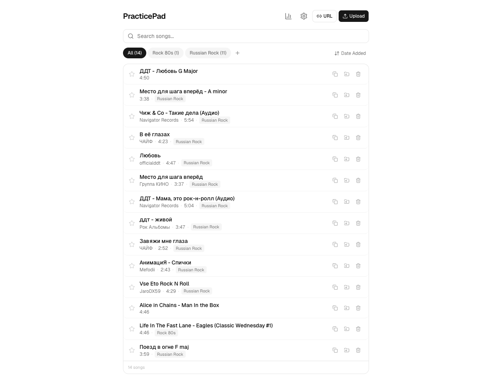
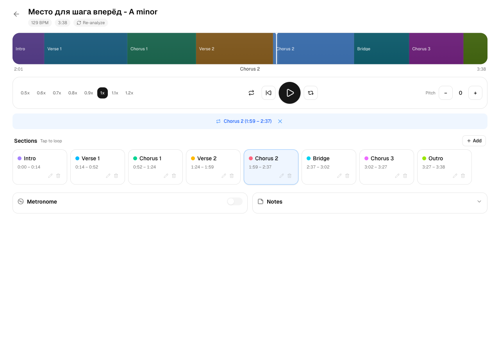
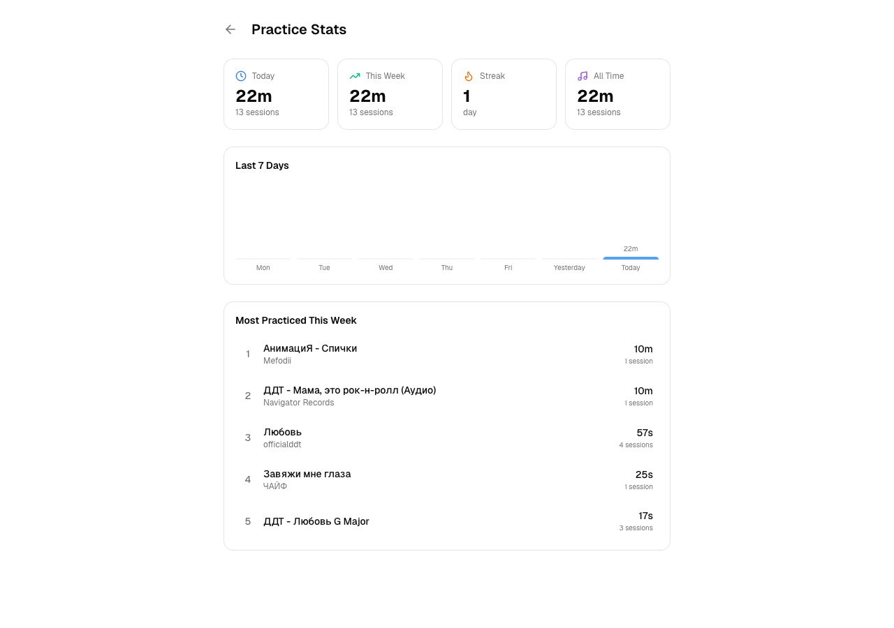
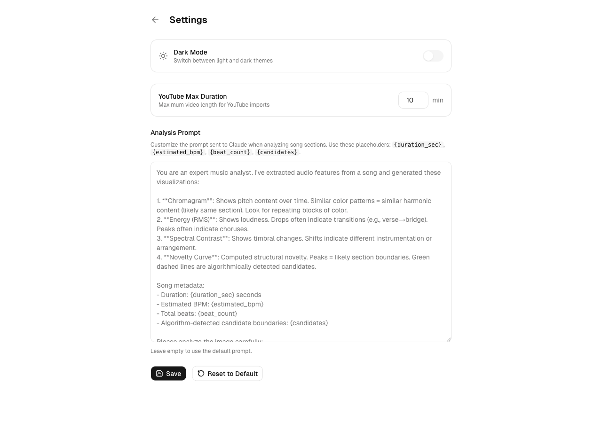

# PracticePad

A local-first guitar practice companion web app. Upload songs or import from YouTube, get AI-powered section detection, and practice with tempo control, pitch shifting, section looping, and a built-in metronome. Optimized for iPad Safari.



## Features

### Song Library
- **Upload MP3/MP4** files or **import from YouTube** by URL
- **AI-powered section detection** — uses librosa audio analysis + Claude Vision to automatically identify Intro, Verse, Chorus, Bridge, Solo, Outro, etc.
- **Auto-detected metadata** — BPM, musical key, artist, album, genre, year (from ID3 tags or YouTube)
- **Folder organization** — create folders, move songs between them
- **Pin songs** to the top of the library
- **Search and sort** by title, artist, date added, or recent

### Practice Player



- **Visual waveform timeline** with color-coded sections — see the full song structure at a glance
- **Tempo control** — slow down to 0.5x or speed up to 1.2x without affecting pitch
- **Pitch shifting** — transpose up or down by up to 12 semitones without affecting duration (server-side processing via ffmpeg, cached per song/pitch)
- **Musical key display** — auto-detected key adjusts when you shift pitch (e.g., A Minor + 2 = B Minor)
- **Section looping** — tap any section to loop it, shift-tap for multi-section ranges
- **A-B looping** — set custom loop points anywhere in the song
- **Whole-song loop** toggle
- **Loop counter** — tracks how many times you've looped each section
- **Built-in metronome** with beat sync, volume control, count-in, tap tempo, and visual beat indicator
- **Practice notes** — add free-text notes per song
- **Re-analyze** — re-run AI section detection with one tap
- **Remembers state** — last position, tempo, pitch, and selected sections are restored on next visit

### Practice Stats



- **Daily, weekly, and all-time** practice time and session counts
- **Practice streak** tracking (consecutive days)
- **7-day bar chart** showing daily practice duration
- **Top 5 most-practiced songs** this week with time and session counts
- Per-section practice logs (loop counts and time spent)

### Settings



- **Dark / light mode**
- **YouTube import** max duration setting
- **Custom analysis prompt** — modify the Claude Vision prompt used for section detection

## Tech Stack

- **Frontend**: Next.js 16, React 19, TypeScript, Tailwind CSS v4, shadcn/ui
- **Database**: SQLite via Prisma with libSQL adapter
- **Audio processing**: ffmpeg/ffprobe for normalization and pitch shifting
- **Audio analysis**: Python (librosa) for BPM, key, beat detection + Claude Vision API for intelligent section segmentation
- **YouTube import**: yt-dlp

## Setup

### Prerequisites

- Node.js 20+
- Python 3.10+ with a virtual environment
- ffmpeg and ffprobe
- yt-dlp (for YouTube imports)
- An Anthropic API key (for AI section detection; falls back to local analysis without it)

### Install

```bash
# Clone the repo
git clone https://github.com/rachokthebot-dev/practicepad.git
cd practicepad

# Set up Python environment
python3 -m venv .venv
source .venv/bin/activate
pip install librosa matplotlib scipy numpy anthropic

# Install Node dependencies
cd app
npm install

# Set up the database
npx prisma migrate dev

# Set your API key
export ANTHROPIC_API_KEY=your_key_here
```

### Run

```bash
# Development (local only)
npm run dev

# Development (accessible from iPad on local network)
npx next dev --hostname 0.0.0.0 --webpack

# Production (recommended for iPad)
npm run build && npm start
```

Access from iPad at `http://<your-mac-ip>:3000`.

## Architecture

```
practicepad/
├── app/                    # Next.js application
│   ├── prisma/             # Database schema & migrations
│   ├── src/
│   │   ├── app/            # Pages and API routes
│   │   │   ├── page.tsx           # Song library
│   │   │   ├── songs/[id]/        # Practice player
│   │   │   ├── stats/             # Practice statistics
│   │   │   ├── settings/          # App settings
│   │   │   └── api/               # REST API endpoints
│   │   ├── hooks/          # Custom React hooks (metronome, pitch shifter)
│   │   ├── components/     # shadcn/ui components
│   │   └── lib/            # Server utilities (audio processing, DB)
│   └── package.json
├── scripts/
│   └── analyze.py          # Audio analysis + Claude Vision integration
└── data/                   # SQLite DB, audio files, uploads
```

## License

MIT
